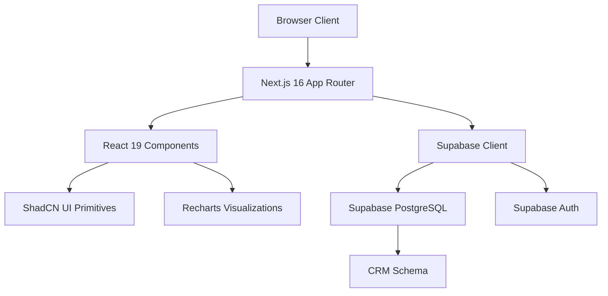
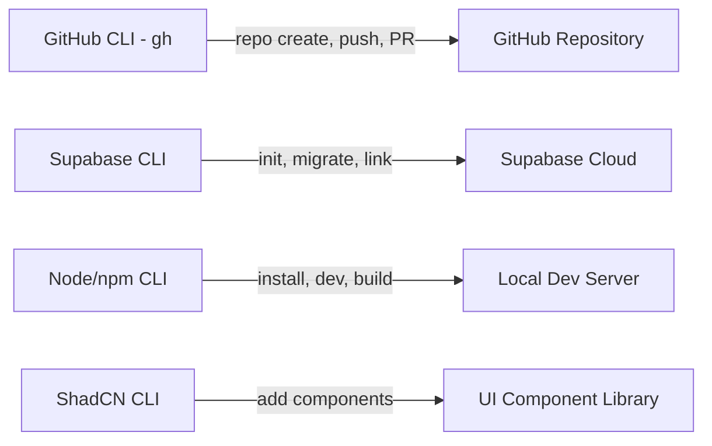
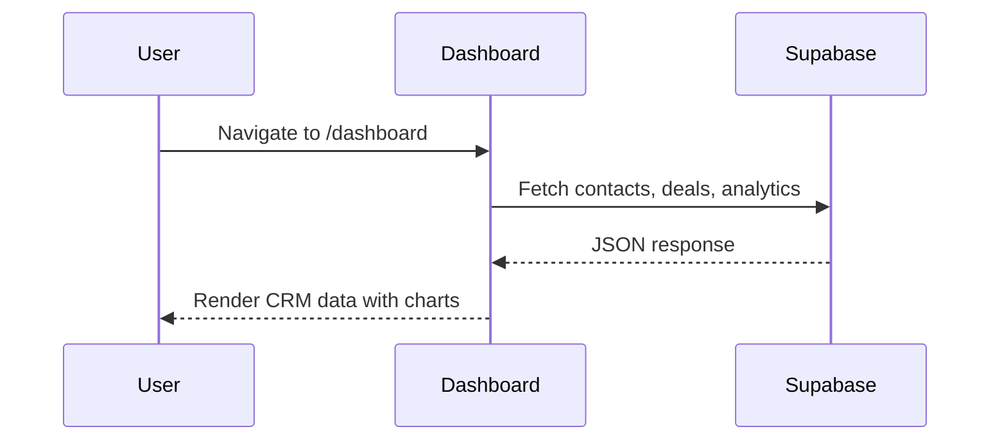

<div align="center">
  
  
  # ShadCN CRM Dashboard Outskill
  
  [](https://www.linkedin.com/in/harshith-vaddiparthy/)
  
  ### 🚀 An Advanced, Production-Ready CRM Blueprint Built for Modern Web Engineering Learners

  [](https://react.dev)
  [](https://nextjs.org)
  [](https://tailwindcss.com)
  [](https://ui.shadcn.com)
  [](LICENSE)
  
  This repository is an educational resource developed as part of the **AI Catalyst C2 deep dive into Antigravity**. It demonstrates how to orchestrate a high-fidelity, interactive client-side dashboard using next-generation tooling.
  
  [🌐 Live Repository](https://github.com/harshith-vaddiparthy/shadCN-CRM-dashboard-outskill) • [🤝 Connect on LinkedIn](https://www.linkedin.com/in/harshith-vaddiparthy/)
</div>

---

## 📖 Deep-Dive Architecture Guide for Learners

This codebase is structured to teach modern React component orchestration and state synchronization patterns:

```
shadCN-CRM-dashboard-outskill/
├── .agents/
│   └── skills/
│       └── shadcn/
│           └── SKILL.md         # shadcn components writing spec loaded by AI agents
├── supabase/
│   └── migrations/
│       └── 001_create_crm_schema.sql  # Database schema (Contacts, Deals)
├── src/
│   ├── app/
│   │   ├── globals.css          # Unified Tailwind v4 Layer Configuration & Theme Variables
│   │   ├── layout.tsx           # Application Root shell, theme injection, and providers
│   │   └── dashboard/
│   │       ├── page.tsx         # Overview page containing key performance KPIs & charts
│   │       ├── contacts/
│   │       │   └── page.tsx     # Contacts registry table page with search/status filters
│   │       ├── deals/
│   │       │   └── page.tsx     # Sales deals pipeline Kanban-style stage board
│   │       └── analytics/
│   │           └── page.tsx     # Funnel reports, Win/loss stats, line curves & leaderboard
│   ├── components/
│   │   ├── app-sidebar.tsx      # Sidebar controller with dataset mapping
│   │   ├── nav-main.tsx         # Collapsible list-item navigation component
│   │   ├── nav-projects.tsx     # Supplemental workspace links list
│   │   ├── nav-user.tsx         # User Profile component containing the Theme Switcher
│   │   ├── team-switcher.tsx    # Sidebar workspace switcher
│   │   └── ui/                  # Atomized base UI primitives (Table, Dialog, Badge, Tabs, etc.)
│   ├── hooks/
│   │   └── use-mobile.ts        # Sidebar responsiveness listener
│   └── lib/
│       └── supabase/            # Client and Server database connection utilities
```

---

## 📊 System Architecture & Relationships

### 1. Application Layer Stack


### 2. CLI Toolchain Lifecycle


### 3. Client-Backend Data Flow


---

## 🛠️ Complete CLI Command Reference

Developers and learners working with this repository rely on these core CLI toolchains:

| CLI Tool | Install Command | Key Commands | Purpose |
|---|---|---|---|
| **GitHub CLI** (`gh`) | `brew install gh` | `gh auth login`<br>`gh repo create`<br>`gh pr create`<br>`gh repo fork` | Repository lifecycle, branch pull requests & remote configuration |
| **Supabase CLI** | `npm i -g supabase` | `supabase init`<br>`supabase link`<br>`supabase db push`<br>`supabase migration new` | Database schema migrations, cloud sync & local DB configuration |
| **Node.js / npm** | Pre-installed | `npm install`<br>`npm run dev` / `npm run build`<br>`npm run lint` | Project packaging, local host running & compilation checks |
| **ShadCN CLI** | Via npx | `npx shadcn@latest init`<br>`npx shadcn@latest add <component>`<br>`npx shadcn@latest diff` | Component installations, updates & custom styling configuration |
| **ShadCN Skills** | Via ShadCN CLI | `npx shadcn@latest add <registry-url>` | Custom registry additions and AI agent skill files setup |

---

## 🎨 Theme Mechanics: The Claymorphism Spec

Rather than styling with standard solid flat colors, this repository implements a custom **Claymorphism** design system. Learners should inspect [globals.css](file:///Users/harshith-macbook-pro-m3/Desktop/Dashboard/src/app/globals.css) to understand how these CSS custom properties are wired:

### 1. Warm-Gray Backdrop and Indigo Primary Colors
* **Light Mode Background**: `rgb(231, 229, 228)`
* **Light Mode Card**: `rgb(245, 245, 244)`
* **Light Mode Primary Indigo**: `rgb(99, 102, 241)`
* **Dark Mode Background**: `rgb(30, 27, 24)`
* **Dark Mode Card**: `rgb(44, 40, 37)`
* **Dark Mode Primary Indigo**: `rgb(129, 140, 248)`

### 2. Rounded Borders & Tactile Shadow Layering
* Rounding is scaled to `--radius: 1.25rem` globally.
* Custom multi-layered box-shadow values recreate a physical, soft-clay tactile feel:
  ```css
  --shadow-sm: 2px 2px 10px 4px hsl(240 4% 60% / 0.18), 2px 1px 2px 3px hsl(240 4% 60% / 0.18);
  ```

---

## ⚡ Key Coding Patterns to Explore

### 🌗 Client-Side Dark Mode Toggle
We implement a zero-flash hydration-safe theme injector inside [layout.tsx](file:///Users/harshith-macbook-pro-m3/Desktop/Dashboard/src/app/layout.tsx) that checks preferences and local storage prior to rendering:
```html
<script
  dangerouslySetInnerHTML={{
    __html: `
      try {
        if (localStorage.getItem('theme') === 'dark' || (!('theme' in localStorage) && window.matchMedia('(prefers-color-scheme: dark)').matches)) {
          document.documentElement.classList.add('dark');
        } else {
          document.documentElement.classList.remove('dark');
        }
      } catch (_) {}
    `,
  }}
/>
```
And a corresponding toggler is active in [nav-user.tsx](file:///Users/harshith-macbook-pro-m3/Desktop/Dashboard/src/components/nav-user.tsx).

### 🚀 Hardware-Accelerated Animations
To keep transitions feeling crisp, transitions use Tailwind's `transform-gpu` to offload work to the graphics card, paired with snappy `150ms` ease-out curves on the sidebar triggers.

---

## 🤝 Learner Contribution Guide

To practice working in a modern development lifecycle, follow this guide using the **GitHub CLI**:

### 1. Fork and Clone the Repository
```bash
# Fork this repository to your own account and clone it locally
gh repo fork harshith-vaddiparthy/shadCN-CRM-dashboard-outskill --clone
```

### 2. Create a Feature Branch
```bash
# Create a dedicated local branch for your code updates
git checkout -b feature/my-crm-enhancement
```

### 3. Make Changes and Commit
```bash
# Track and commit changes locally
git add .
git commit -m "feat: enhance client-side KPI filters"
```

### 4. Push and Open a Pull Request
```bash
# Push your branch upstream
git push origin feature/my-crm-enhancement

# Submit your code changes for review
gh pr create --title "feat: CRM KPI Filters" --body "Detailed description of my modifications."
```

---

## 💾 Supabase Setup Guide for Learners

To bind this dashboard to a live Supabase backend database:

1. **Sign Up / Login** at [supabase.com](https://supabase.com).
2. **Create a New Project** inside your Supabase dashboard workspace.
3. **Link Local Migrations**:
   ```bash
   # Login to your Supabase CLI session
   npx supabase login
   
   # Link the project (you can find your reference ID in your Supabase project settings)
   npx supabase link --project-ref your-project-reference-id
   ```
4. **Deploy Schema**:
   ```bash
   # Push the CRM SQL tables (contacts, deals) to your live database
   npx supabase db push
   ```
5. **Configure Env Variables**:
   Copy `.env.local.example` to `.env.local` and substitute in your Supabase URL and public API token key.

---

## 🤝 Connect and Collaborate

Developed as an educational sandbox. For questions, feedback, or to discuss agentic software development, connect on LinkedIn:

<p align="center">
  <a href="https://www.linkedin.com/in/harshith-vaddiparthy/">
    
  </a>
</p>
